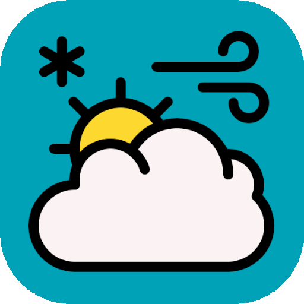
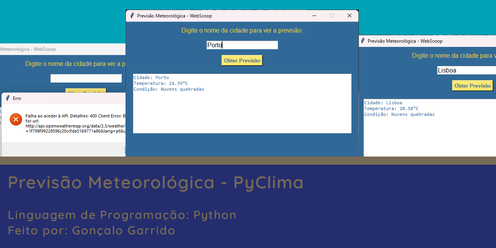
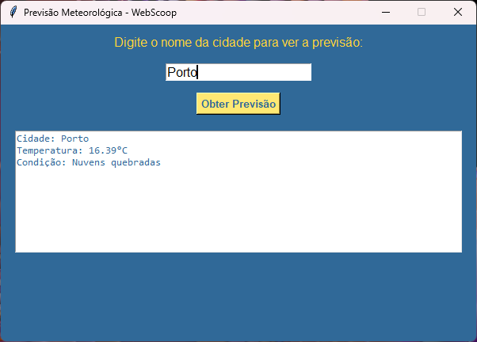
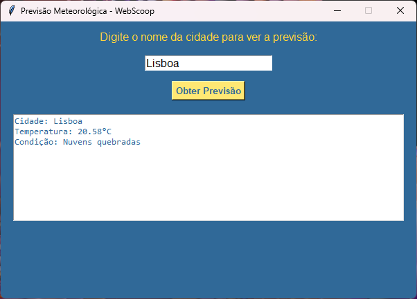
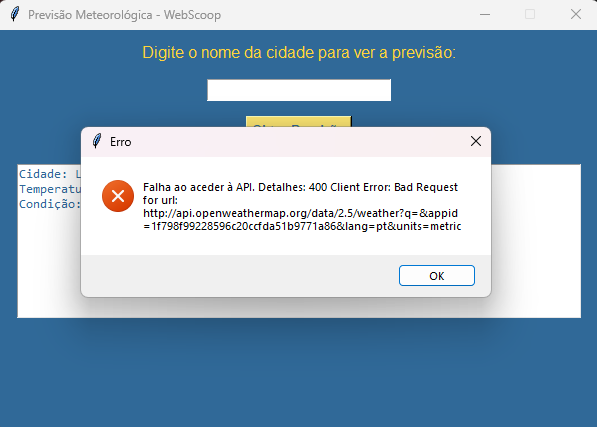

#  <br>WebScoop - Previsão Meteorológica



Aplicação simples e eficaz para obter previsões meteorológicas de qualquer cidade através de uma interface gráfica amigável.

## Descrição

O projeto **WebScoop - Previsão Meteorológica** foi criado com o objetivo de permitir aos utilizadores consultar a previsão do tempo de forma fácil e rápida. Esta aplicação utiliza a API do OpenWeatherMap para recolher dados climáticos em tempo real e exibi-los numa interface gráfica construída com `tkinter`. É ideal para aprender a usar bibliotecas de rede, como `requests`, e manipulação de interfaces gráficas em Python.

## Funcionalidades

- [x] Consultar a previsão do tempo de qualquer cidade.
- [x] Exibir a temperatura atual e as condições meteorológicas.
- [x] Interface gráfica intuitiva e de fácil utilização.
- [x] Tratamento de erros de conexão e mensagens informativas.
- [ ] Implementação futura: exibição de previsões para vários dias.

## Tecnologias Utilizadas

- **Linguagem de Programação**: Python
- **Bibliotecas**:
  - `tkinter` para a interface gráfica.
  - `requests` para obter dados da API.
  - `BeautifulSoup` (possível uso futuro para formatação de dados).
- **IDE**: Visual Studio Code

## Capturas de Ecrã

Visuais -> [Ver Agora](./Docs/Pages/Visual.md)

| Captura 1 | Captura 2 | Captura 3 |
|-----------|-----------|-----------|
|  |  |  |

## Como Utilizar

1. **Dar Clone**:
    ```bash
     git clone https://github.com/ProjetosLendarios/PyClima.git
     ```
## Contribuições

Contribuições são bem-vindas! Sinta-se à vontade para enviar issues ou pull requests com sugestões de novas funcionalidades ou melhorias de código.

## Autor
<br>
**Nome**: Gonçalo Garrido  
**Email**: Goncalosantosgarrido+LearningProgram@gmail.com  

[](https://goncalogarrido2.github.io/GoncaloGarrido/)
